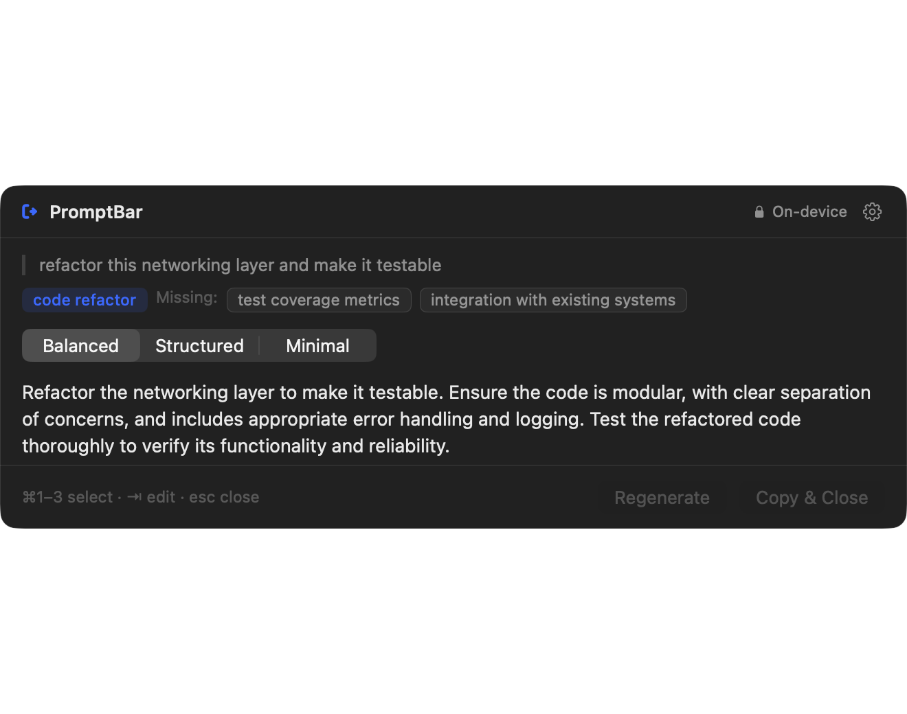

<p align="center">
  
</p>

<h1 align="center">PromptBar</h1>

<p align="center">
  Turn rough thoughts into prompts that work.
</p>

<p align="center">
  <a href="LICENSE"></a>
  
  
  
  <a href="../../actions/workflows/ci.yml"></a>
</p>

<p align="center">
  
</p>

Copy a rough instruction, press a shortcut, and PromptBar rewrites it into a prompt
another AI can actually execute, then puts it on your clipboard and disappears.

Every enhancement runs on Apple's on-device Foundation Models, nothing leaves your Mac, free.

## Features

- **Three genuinely different variants** — *Minimal* keeps your wording, *Balanced* is
  prose, *Structured* emits `Objective / Context / Requirements / Constraints /
  Expected output`. They differ by construction, not by chance: each is a separate
  guided-generation field with its own structural contract.
- **It never invents context** — the instruction set is mostly prohibitions. No invented
  word counts, tones, audiences or deadlines; missing details become `[placeholders]`,
  and ambiguous terms keep the user's own wording.
- **Target profiles** — General AI, Coding Agent, Research, Writing, Image Generation, or
  Auto. The profile shapes the rewrite and stays visible and editable.
- **Instant Enhance** — `⌃⌥P` rewrites the clipboard in place with no window at all, and
  keeps a restore point.
- **Keyboard-first** — the default flow is copy → shortcut → `↵`. No pointer required.
- **Prompt check** — a local, deterministic linter rates the input before the model runs.
- **Optional local history** — off until you turn it on, stored only in the app
  container, with retention limits and per-app exclusions.
- **Private by construction** — the privacy claims in Settings are derived from the
  active provider's capabilities, so they cannot drift out of sync with reality.

### Adding another model provider

`PromptModel` is the only thing a new provider implements. It carries everything the rest
of the app needs to know, so nothing outside `Engine/` has to change:

| Requirement | Why it is on the seam |
|---|---|
| `capabilities` | Input limits and the provider's name/on-device status. The UI sizes inputs and words its privacy claims from this, instead of hard-coding Apple's numbers. |
| `availability()` | Maps provider state to a product failure. |
| `enhance(_:)` | Returns an `EnhancementBundle`; use `EnhancementAssembler` for ordering, fence stripping and missing-context normalisation. |
| `recovery(for:)` | Recovery is provider-specific — Apple deep-links to its Settings pane; a cloud provider might open an account page. |

`EnhancementFailure` already carries neutral cases (`networkUnavailable`, `notAuthorized`,
`quotaExceeded`, `timedOut`) so a networked provider has somewhere to land.

## Install

### Homebrew

```bash
brew tap tornikegomareli/tap
brew install --cask promptbar
```

The app installs to `/Applications`. Launch it once so the menu bar item appears. To
update or remove:

```bash
brew upgrade --cask promptbar     # update to the latest release
brew uninstall --cask promptbar   # remove the app
brew uninstall --zap promptbar    # also remove settings and local history
```

### From source

```bash
git clone https://github.com/tornikegomareli/PromptBar.git
cd PromptBar
Scripts/compile_and_run.sh --test   # test + package + launch
```

PromptBar runs as a menu bar app with no Dock icon. Open the panel with **⇧⌥Space**, or
from the menu bar item. Quit from the same menu.

Requires **Apple Intelligence to be enabled** (System Settings → Apple Intelligence &
Siri). If it is off, PromptBar says so and offers to open the right pane rather than
failing quietly.

## Keyboard

| Key | Action |
| --- | --- |
| `⇧⌥Space` | Open PromptBar |
| `⌃⌥P` | Instant Enhance the clipboard, no window |
| `⌘↵` | Generate from typed input |
| `↵` | Copy the selected variant and close |
| `⌘1` `⌘2` `⌘3` | Select Balanced / Structured / Minimal |
| `←` `→` | Move between variants |
| `⌘R` | Regenerate |
| `⇧⌘C` | Copy without closing |
| `⇥` | Edit the result |
| `⌘,` | Settings |
| `esc` | Close |

## Notes

- The on-device session shares one 4,096-token window between the instructions, the
  schema, your input and all three outputs — hence the ~4,000 character input ceiling.
  PromptBar warns before it, and refuses rather than silently truncating.
- History is written only when you copy, only when enabled, and never for apps on the
  exclusion list.

## License

[MIT](LICENSE).
